# AI Trend Research Engine

Un sistema automatizado y modular para la investigación de tendencias en Inteligencia Artificial. Recopila, procesa y analiza datos de múltiples fuentes para descubrir *insights*, generar informes y mantener un ciclo de vida de palabras clave en constante evolución.


<p align="center">
  <strong>Languages:</strong>
  <br>
  <a href="#-english">English</a> | <a href="#-español">Español</a> | <a href="#-català">Català</a>
</p>

---

<a name="-english"></a>
## 🇬🇧 English

<details>
<summary><strong>Table of Contents</strong></summary>

- [🚀 Key Features](#-key-features-1)
- [🏛️ System Architecture](#️-system-architecture)
- [💻 Tech Stack](#-tech-stack)
- [🛠️ Installation and Setup](#️-installation-and-setup-1)
- [▶️ Usage](#️-usage-1)
- [🤝 Contributing](#-contributing-1)
- [📄 License](#-license-1)

</details>

### AI Trend Research Engine

An automated and modular system for researching trends in Artificial Intelligence. It collects and processes data from multiple platforms (GitHub, YouTube, ArXiv, etc.), uses large language models (LLMs) to extract insights, discover new keywords, and generates comprehensive reports in multiple formats (JSON, Notion, Supabase).

**Note:** This project was developed by modifying the [EmpowerHerDev/ai-trend-research-system](https://github.com/EmpowerHerDev/ai-trend-research-system) project and integrating the custom research server from [Ladvien/research_hub_mcp](https://github.com/Ladvien/research_hub_mcp). The result is a flexible and modular system that now supports multiple large language model (LLM) providers, including **OpenAI (GPT), Google (Gemini), Anthropic (Claude), Groq, and Ollama**. This work is also part of a personal learning journey in the field of artificial intelligence agent development.

### 🚀 Key Features

-   **Multi-Platform Research**: Gathers data from YouTube, GitHub, web searches, ArXiv, HackerNews, and a custom paper research engine.
-   **Multi-LLM Support**: Seamlessly switch between different LLM providers like OpenAI, Gemini, Groq, Anthropic, and local models with Ollama.
-   **AI-Powered Analysis**: Uses LLMs for advanced tasks such as intelligent keyword extraction, dynamic recommendation generation, and multilingual query translation.
-   **Asynchronous Architecture**: Built with `asyncio` for high concurrency and efficiency in handling network I/O and managing multiple data source servers.
-   **Automated Reporting**: Automatically creates detailed reports in **JSON** (for local archiving), **Notion** (for collaborative workspaces), and **Supabase** (for long-term data persistence).
-   **Dynamic Keyword Lifecycle**: Implements a full lifecycle for keywords: discovery, scoring, active research, and history tracking, all managed through simple JSON files.
-   **Decoupled & Standardized**: Uses the **Model Context Protocol (MCP)** to communicate with each platform's server, ensuring a standardized, modular, and easily extensible interface.
-   **Highly Configurable**: All settings (API keys, AI model selection, file paths) are managed through a single `.env` file for easy portability and security.

### 🏛️ System Architecture

The system is designed with a modular architecture where a central orchestrator manages various specialized components. The communication with external data sources is standardized through MCP servers.


-   **Orchestrator (`ai_trend_researcher.py`)**: The main script that coordinates the entire research workflow, from loading keywords to generating final reports.
-   **Configuration (`config_manager.py`)**: Loads and validates all environment variables and server settings.
-   **Connectivity (`mcp_client_manager.py`)**: Manages the lifecycle (start, connect, call, stop) of all MCP servers for the data platforms.
-   **AI Factory (`ai_client_manager.py`)**: Provides a unified interface to interact with various LLM providers.
-   **Platform Logic (`platform_handlers.py`)**: Contains the specific logic for querying each platform and standardizing its response.
-   **Analysis (`data_processor.py`)**: Uses LLMs and heuristics to extract new keywords, score them, and generate actionable recommendations.
-   **Reporting (`report_generator.py`)**: Creates the final reports in all supported formats.
-   **Keyword Database (`keyword_manager.py`)**: Manages the state of keywords across research cycles.

### 💻 Tech Stack

-   **Backend**: Python 3.9+
-   **Concurrency**: `asyncio`
-   **AI Providers**: OpenAI, Google Gemini, Anthropic Claude, Groq, Ollama
-   **Tool Protocol**: Model Context Protocol (MCP)
-   **Dependencies**: `python-dotenv`, `aiofiles`, provider-specific SDKs (e.g., `openai`, `google-generativeai`)
-   **Prerequisites**: Node.js & npm (to run community MCP servers via `npx`), Rust (optional, to compile the `research_hub` server)

### 🛠️ Installation and Setup

#### 1. Prerequisites

-   **Python 3.9+**
-   **Node.js and npm** (required for `npx`, which runs the community's MCP servers).
-   **Git**
-   (Optional) **Rust Compiler**, if you want to compile the `research_hub` executable from the source code. Otherwise, you can use a pre-compiled binary.

#### 2. Clone the Repository

```bash
git clone https://github.com/your-user/your-repository.git
cd your-repository
```

#### 3. Install Python Dependencies

It is highly recommended to use a virtual environment.

```bash
python -m venv venv
# On macOS/Linux:
source venv/bin/activate
# On Windows:
venv\Scripts\activate

pip install -r requirements.txt
```

#### 4. Configure Environment Variables

This is the most critical step.

1.  Create your environment file from the example:
    ```bash
    cp .env.example .env
    ```
2.  Open the `.env` file and fill in your API keys and paths. You only need to fill in the keys for the services you intend to use.

    ```env
    # .env

    # --- AI Provider Configuration ---
    # Choose one: "openai", "gemini", "groq", "anthropic", "ollama"
    AI_PROVIDER="openai"

    # Fill in the API keys for the providers you might use.
    OPENAI_API_KEY="sk-..."
    GOOGLE_API_KEY="AIzaSy..."
    GROQ_API_KEY="gsk_..."
    ANTHROPIC_API_KEY="sk-ant-..."
    # No key needed for Ollama

    # --- (Optional) Specific AI Models ---
    AI_MODEL_OPENAI="gpt-4o"
    AI_MODEL_GEMINI="gemini-1.5-flash"
    # ... and so on for other providers

    # --- API Keys for Data Sources ---
    YOUTUBE_API_KEY=AIzaSy...
    GITHUB_PERSONAL_ACCESS_TOKEN=ghp_...

    # --- API Keys for Report Outputs ---
    NOTION_API_KEY=secret_...
    NOTION_PARENT_PAGE_ID=xxxxxxxxxxxxxxxxxxxxxxxxxxxxxxxx
    SUPABASE_ACCESS_TOKEN=eyJhbGciOi...

    # --- System Path Configuration (IMPORTANT!) ---
    # MUST be absolute paths.
    RESEARCH_PAPERS_DIR="/path/on/your/machine/research-papers"
    RESEARCH_HUB_EXECUTABLE="/path/on/your/machine/rust-research-mcp"
    ```

#### 5. Set Up the Database (Supabase)

If you plan to use the Supabase integration, make sure your database table matches the schema defined in `supabase_schema.sql`. You can run this script in the SQL editor of your Supabase project.

### ▶️ Usage

The project has two main execution workflows.

#### 1. Daily Trend Research

This is the primary workflow. It runs research on all enabled platforms using the keywords in `keywords/active.json`, analyzes the data, discovers new keywords, and generates reports.

```bash
python ai_trend_researcher.py
```
The script will log its progress to the console. When it finishes, you will find:
- A JSON report in the `reports/` directory.
- A new page in your specified Notion workspace (if configured).
- A new record in your Supabase table (if configured).

#### 2. Deep Dive Research (`research_assistant`)

This advanced script uses the custom `research_hub` server to perform in-depth academic research. It searches for papers, downloads PDFs, and generates bibliographies.

1. Ensure the `RESEARCH_HUB_EXECUTABLE` path in your `.env` is correct.
2. Add search terms to the `terminos.txt` file (one per line).

```bash
python research_assistant.py
```
The results (CSVs, JSONs, BibTeX files, and logs) will be saved in a timestamped subdirectory within `salidas/` to keep each run organized.

### 🤝 Contributing

Contributions are welcome! If you have ideas for improving the project, new platforms to integrate, or find any bugs, please open an issue or submit a pull request.

### 📄 License

This project is licensed under the MIT License. See the `LICENSE` file for more details.

---

<a name="-español"></a>
## 🇪🇸 Español

<details>
<summary><strong>Tabla de Contenidos</strong></summary>

- [🚀 Características Principales](#-características-principales-1)
- [🏛️ Arquitectura del Sistema](#️-arquitectura-del-sistema)
- [💻 Stack Tecnológico](#-stack-tecnológico)
- [🛠️ Instalación y Configuración](#️-instalación-y-configuración-1)
- [▶️ Uso](#️-uso-1)
- [🤝 Contribuciones](#-contribuciones-1)
- [📄 Licencia](#-licencia-1)

</details>

### AI Trend Research Engine

Un sistema automatizado y modular para la investigación de tendencias en Inteligencia Artificial. Recopila y procesa datos de múltiples plataformas (GitHub, YouTube, ArXiv, etc.), utiliza modelos de lenguaje (LLMs) para extraer *insights*, descubrir nuevas palabras clave y genera informes completos en múltiples formatos (JSON, Notion, Supabase).

**Nota:** Este proyecto ha sido desarrollado modificando el proyecto [EmpowerHerDev/ai-trend-research-system](https://github.com/EmpowerHerDev/ai-trend-research-system) e integrando el servidor de investigación personalizado de [Ladvien/research_hub_mcp](https://github.com/Ladvien/research_hub_mcp). El resultado es un sistema flexible y modular que ahora es compatible con múltiples proveedores de modelos de lenguaje grande (LLM), incluyendo **OpenAI (GPT), Google (Gemini), Anthropic (Claude), Groq y Ollama**. Este trabajo también forma parte de un proceso de aprendizaje personal en el campo del desarrollo de agentes de inteligencia artificial.

### 🚀 Características Principales

-   **Investigación Multiplataforma**: Recopila datos de YouTube, GitHub, búsquedas web, ArXiv, HackerNews y un motor de investigación de *papers* personalizado.
-   **Soporte Multi-LLM**: Cambia fácilmente entre diferentes proveedores de LLM como OpenAI, Gemini, Groq, Anthropic y modelos locales con Ollama.
-   **Análisis con IA**: Utiliza LLMs para tareas avanzadas como la extracción inteligente de palabras clave, la generación de recomendaciones dinámicas y la traducción de consultas multilingües.
-   **Arquitectura Asíncrona**: Construido con `asyncio` para una alta concurrencia y eficiencia en el manejo de I/O de red y la gestión de múltiples servidores de datos.
-   **Informes Automatizados**: Crea automáticamente informes detallados en **JSON** (para archivo local), **Notion** (para espacios de trabajo colaborativos) y **Supabase** (para persistencia de datos a largo plazo).
-   **Ciclo de Vida Dinámico de Keywords**: Implementa un ciclo de vida completo para las palabras clave: descubrimiento, puntuación, investigación activa y seguimiento histórico, todo gestionado a través de simples archivos JSON.
-   **Desacoplado y Estandarizado**: Utiliza el **Model Context Protocol (MCP)** para comunicarse con el servidor de cada plataforma, asegurando una interfaz estandarizada, modular y fácilmente extensible.
-   **Altamente Configurable**: Toda la configuración (API keys, selección de modelos de IA, rutas de archivos) se gestiona a través de un único archivo `.env` para facilitar la portabilidad y seguridad.

### 🏛️ Arquitectura del Sistema

El sistema está diseñado con una arquitectura modular donde un orquestador central gestiona varios componentes especializados. La comunicación con las fuentes de datos externas se estandariza a través de servidores MCP.


-   **Orquestador (`ai_trend_researcher.py`)**: El script principal que coordina todo el flujo de investigación, desde la carga de keywords hasta la generación de informes finales.
-   **Configuración (`config_manager.py`)**: Carga y valida todas las variables de entorno y configuraciones de los servidores.
-   **Conectividad (`mcp_client_manager.py`)**: Gestiona el ciclo de vida (inicio, conexión, llamada, cierre) de todos los servidores MCP para las plataformas de datos.
-   **Fábrica de IA (`ai_client_manager.py`)**: Proporciona una interfaz unificada para interactuar con diversos proveedores de LLM.
-   **Lógica de Plataformas (`platform_handlers.py`)**: Contiene la lógica específica para consultar cada plataforma y estandarizar su respuesta.
-   **Análisis (`data_processor.py`)**: Utiliza LLMs y heurísticas para extraer nuevas palabras clave, puntuarlas y generar recomendaciones accionables.
-   **Informes (`report_generator.py`)**: Crea los informes finales en todos los formatos soportados.
-   **Base de Datos de Keywords (`keyword_manager.py`)**: Administra el estado de las palabras clave a través de los ciclos de investigación.

### 💻 Stack Tecnológico

-   **Backend**: Python 3.9+
-   **Concurrencia**: `asyncio`
-   **Proveedores IA**: OpenAI, Google Gemini, Anthropic Claude, Groq, Ollama
-   **Protocolo de Herramientas**: Model Context Protocol (MCP)
-   **Dependencias**: `python-dotenv`, `aiofiles`, SDKs de proveedores (ej. `openai`, `google-generativeai`)
-   **Prerrequisitos**: Node.js & npm (para ejecutar servidores MCP de la comunidad vía `npx`), Rust (opcional, para compilar el servidor `research_hub`)

### 🛠️ Instalación y Configuración

#### 1. Prerrequisitos

-   **Python 3.9+**
-   **Node.js y npm** (necesario para `npx`, que ejecuta los servidores MCP de la comunidad).
-   **Git**
-   (Opcional) **Compilador de Rust**, si deseas compilar el ejecutable de `research_hub` desde el código fuente. Si no, puedes usar un binario precompilado.

#### 2. Clonar el Repositorio

```bash
git clone https://github.com/tu-usuario/tu-repositorio.git
cd tu-repositorio
```

#### 3. Instalar Dependencias de Python

Se recomienda encarecidamente utilizar un entorno virtual.

```bash
python -m venv venv
# En macOS/Linux:
source venv/bin/activate
# En Windows:
venv\Scripts\activate

pip install -r requirements.txt
```

#### 4. Configurar las Variables de Entorno

Este es el paso más crítico.

1.  Crea tu archivo de entorno a partir del ejemplo:
    ```bash
    cp .env.example .env
    ```
2.  Abre el archivo `.env` y rellena tus claves de API y rutas. Solo necesitas rellenar las claves para los servicios que vayas a utilizar.

    ```env
    # .env

    # --- Configuración del Proveedor de IA ---
    # Elige uno: "openai", "gemini", "groq", "anthropic", "ollama"
    AI_PROVIDER="openai"

    # Rellena las claves de API para los proveedores que puedas usar.
    OPENAI_API_KEY="sk-..."
    GOOGLE_API_KEY="AIzaSy..."
    GROQ_API_KEY="gsk_..."
    ANTHROPIC_API_KEY="sk-ant-..."
    # No se necesita clave para Ollama

    # --- (Opcional) Modelos Específicos de IA ---
    AI_MODEL_OPENAI="gpt-4o"
    AI_MODEL_GEMINI="gemini-1.5-flash"
    # ... etc. para otros proveedores

    # --- Claves de API para Fuentes de Datos ---
    YOUTUBE_API_KEY=AIzaSy...
    GITHUB_PERSONAL_ACCESS_TOKEN=ghp_...

    # --- Claves de API para Salidas de Informes ---
    NOTION_API_KEY=secret_...
    NOTION_PARENT_PAGE_ID=xxxxxxxxxxxxxxxxxxxxxxxxxxxxxxxx
    SUPABASE_ACCESS_TOKEN=eyJhbGciOi...

    # --- Configuración de Rutas del Sistema (¡IMPORTANTE!) ---
    # DEBEN ser rutas absolutas.
    RESEARCH_PAPERS_DIR="/ruta/en/tu/maquina/research-papers"
    RESEARCH_HUB_EXECUTABLE="/ruta/en/tu/maquina/rust-research-mcp"
    ```

#### 5. Configurar la Base de Datos (Supabase)

Si planeas usar la integración con Supabase, asegúrate de que tu tabla en la base de datos coincida con el esquema definido en `supabase_schema.sql`. Puedes ejecutar ese script en el editor SQL de tu proyecto de Supabase.

### ▶️ Uso

El proyecto tiene dos flujos de ejecución principales.

#### 1. Investigación Diaria de Tendencias

Este es el flujo de trabajo principal. Ejecuta la investigación en todas las plataformas habilitadas usando las palabras clave de `keywords/active.json`, analiza los datos, descubre nuevas keywords y genera informes.

```bash
python ai_trend_researcher.py
```
El script registrará su progreso en la consola. Cuando finalice, encontrarás:
- Un informe JSON en el directorio `reports/`.
- Una nueva página en tu espacio de trabajo de Notion (si está configurado).
- Un nuevo registro en tu tabla de Supabase (si está configurado).

#### 2. Inmersión Profunda de Investigación (`research_assistant`)

Este script avanzado utiliza el servidor personalizado `research_hub` para realizar investigaciones académicas en profundidad. Busca *papers*, descarga los PDF y genera bibliografías.

1. Asegúrate de que la ruta `RESEARCH_HUB_EXECUTABLE` en tu `.env` sea correcta.
2. Añade términos de búsqueda al archivo `terminos.txt` (uno por línea).

```bash
python research_assistant.py
```
Los resultados (CSVs, JSONs, archivos BibTeX y logs) se guardarán en un subdirectorio con marca de tiempo dentro de `salidas/` para mantener cada ejecución organizada.

### 🤝 Contribuciones

¡Las contribuciones son bienvenidas! Si tienes ideas para mejorar el proyecto, nuevas plataformas para integrar o encuentras algún error, por favor abre un *issue* o envía un *pull request*.

### 📄 Licencia

Este proyecto está bajo la Licencia MIT. Consulta el archivo `LICENSE` para más detalles.

---

<a name="-català"></a>
## CAT Català

<details>
<summary><strong>Taula de Continguts</strong></summary>

- [🚀 Característiques Principals](#-característiques-principals-2)
- [🏛️ Arquitectura del Sistema](#️-arquitectura-del-sistema-1)
- [💻 Stack Tecnològic](#-stack-tecnològic-1)
- [🛠️ Instal·lació i Configuració](#️-installació-i-configuració-2)
- [▶️ Ús](#️-ús-2)
- [🤝 Contribucions](#-contribucions-2)
- [📄 Llicència](#-llicència-2)

</details>

### AI Trend Research Engine

Un sistema automatitzat i modular per a la investigació de tendències en Intel·ligència Artificial. Recopila i processa dades de múltiples plataformes (GitHub, YouTube, ArXiv, etc.), utilitza models de llenguatge (LLMs) per extreure *insights*, descobrir noves paraules clau i genera informes complets en múltiples formats (JSON, Notion, Supabase).

**Nota:** Aquest projecte ha estat desenvolupat modificant el projecte [EmpowerHerDev/ai-trend-research-system](https://github.com/EmpowerHerDev/ai-trend-research-system) i integrant el servidor de recerca personalitzat de [Ladvien/research_hub_mcp](https://github.com/Ladvien/research_hub_mcp). El resultat és un sistema flexible i modular que ara és compatible amb múltiples proveïdors de models de llenguatge grans (LLM), incloent-hi **OpenAI (GPT), Google (Gemini), Anthropic (Claude), Groq i Ollama**. Aquest treball también forma part d'un procés d'aprenentatge personal en el camp del desenvolupament d'agents d'intel·ligència artificial.

### 🚀 Característiques Principals

-   **Recerca Multiplataforma**: Recopila dades de YouTube, GitHub, cerques web, ArXiv, HackerNews i un motor de recerca de *papers* personalitzat.
-   **Suport Multi-LLM**: Canvia fàcilment entre diferents proveïdors de LLM com OpenAI, Gemini, Groq, Anthropic i models locals amb Ollama.
-   **Anàlisi amb IA**: Utilitza LLMs per a tasques avançades com l'extracció intel·ligent de paraules clau, la generació de recomanacions dinàmiques i la traducció de consultes multilingües.
-   **Arquitectura Asíncrona**: Construït amb `asyncio` per a una alta concurrència i eficiència en la gestió d'I/O de xarxa i la gestió de múltiples servidors de dades.
-   **Informes Automatitzats**: Crea automàticament informes detallats en **JSON** (per a arxiu local), **Notion** (per a espais de treball col·laboratius) i **Supabase** (per a persistència de dades a llarg termini).
-   **Cicle de Vida Dinàmic de Keywords**: Implementa un cicle de vida complet per a les paraules clau: descobriment, puntuació, recerca activa i seguiment històric, tot gestionat a través de simples fitxers JSON.
-   **Desacoblat i Estandarditzat**: Utilitza el **Model Context Protocol (MCP)** per comunicar-se amb el servidor de cada plataforma, assegurant una interfície estandarditzada, modular i fàcilment extensible.
-   **Altament Configurable**: Tota la configuració (claus d'API, selecció de models d'IA, rutes de fitxers) es gestiona a través d'un únic fitxer `.env` per facilitar la portabilitat i seguretat.

### 🏛️ Arquitectura del Sistema

El sistema està dissenyat amb una arquitectura modular on un orquestrador central gestiona diversos components especialitzats. La comunicació amb les fonts de dades externes s'estandarditza a través de servidors MCP.

```mermaid
graph TD
    subgraph "Motor Principal"
        A[ai_trend_researcher.py] --> B{KeywordManager};
        A --> C{MCPClientManager};
        A --> D{DataProcessor};
        A --> E{ReportManager};
    end

    subgraph "Integració IA"
        F[AIClientManager] -- Gestiona --> G[OpenAI, Gemini, Groq, ...];
        D -- Utilitza --> F;
    end

    subgraph "Fonts de Dades (via MCP)"
        C -- Connecta a --> H[Servidor YouTube];
        C -- Connecta a --> I[Servidor GitHub];
        C -- Connecta a --> J[Servidor ArXiv];
        C -- Connecta a --> K[Web/HackerNews...];
        C -- Connecta a --> L[Servidor ResearchHub];
    end

    subgraph "Informes de Sortida"
        E -- Genera --> M[Fitxers JSON];
        E -- Genera --> N[Pàgines a Notion];
        E -- Genera --> O[Registres a Supabase];
    end

    B --> A;
```



-   **Orquestrador (`ai_trend_researcher.py`)**: L'script principal que coordina tot el flux de recerca, des de la càrrega de paraules clau fins a la generació d'informes finals.
-   **Configuració (`config_manager.py`)**: Carrega i valida totes les variables d'entorn i configuracions dels servidors.
-   **Connectivitat (`mcp_client_manager.py`)**: Gestiona el cicle de vida (inici, connexió, trucada, tancament) de tots els servidors MCP per a les plataformes de dades.
-   **Fàbrica d'IA (`ai_client_manager.py`)**: Proporciona una interfície unificada per interactuar amb diversos proveïdors de LLM.
-   **Lògica de Plataformes (`platform_handlers.py`)**: Conté la lògica específica per consultar cada plataforma i estandarditzar la seva resposta.
-   **Anàlisi (`data_processor.py`)**: Utilitza LLMs i heurístiques per extreure noves paraules clau, puntuar-les i generar recomanacions accionables.
-   **Informes (`report_generator.py`)**: Crea els informes finals en tots els formats suportats.
-   **Base de Dades de Keywords (`keyword_manager.py`)**: Administra l'estat de les paraules clau a través dels cicles de recerca.

### 💻 Stack Tecnològic

-   **Backend**: Python 3.9+
-   **Concurrència**: `asyncio`
-   **Proveïdors IA**: OpenAI, Google Gemini, Anthropic Claude, Groq, Ollama
-   **Protocol d'Eines**: Model Context Protocol (MCP)
-   **Dependències**: `python-dotenv`, `aiofiles`, SDKs de proveïdors (ex. `openai`, `google-generativeai`)
-   **Prerequisits**: Node.js & npm (per executar servidors MCP de la comunitat via `npx`), Rust (opcional, per compilar el servidor `research_hub`)

### 🛠️ Instal·lació i Configuració

#### 1. Prerequisits

-   **Python 3.9+**
-   **Node.js i npm** (necessari per a `npx`, que executa els servidors MCP de la comunitat).
-   **Git**
-   (Opcional) **Compilador de Rust**, si vols compilar l'executable de `research_hub` des del codi font. Si no, pots fer servir un binari precompilat.

#### 2. Clonar el Repositori

```bash
git clone https://github.com/el-teu-usuari/el-teu-repositori.git
cd el-teu-repositori
```

#### 3. Instal·lar Dependències de Python

És molt recomanable utilitzar un entorn virtual.

```bash
python -m venv venv
# A macOS/Linux:
source venv/bin/activate
# A Windows:
venv\Scripts\activate

pip install -r requirements.txt
```

#### 4. Configurar les Variables d'Entorn

Aquest és el pas més crític.

1.  Crea el teu fitxer d'entorn a partir de l'exemple:
    ```bash
    cp .env.example .env
    ```
2.  Obre el fitxer `.env` i omple les teves claus d'API i rutes. Només cal omplir les claus per als serveis que vulguis utilitzar.

    ```env
    # .env

    # --- Configuració del Proveïdor d'IA ---
    # Tria'n un: "openai", "gemini", "groq", "anthropic", "ollama"
    AI_PROVIDER="openai"

    # Omple les claus d'API per als proveïdors que puguis utilitzar.
    OPENAI_API_KEY="sk-..."
    GOOGLE_API_KEY="AIzaSy..."
    GROQ_API_KEY="gsk_..."
    ANTHROPIC_API_KEY="sk-ant-..."
    # No cal clau per a Ollama

    # --- (Opcional) Models Específics d'IA ---
    AI_MODEL_OPENAI="gpt-4o"
    AI_MODEL_GEMINI="gemini-1.5-flash"
    # ... etc. per a altres proveïdors

    # --- Claus d'API per a Fonts de Dades ---
    YOUTUBE_API_KEY=AIzaSy...
    GITHUB_PERSONAL_ACCESS_TOKEN=ghp_...

    # --- Claus d'API per a Sortides d'Informes ---
    NOTION_API_KEY=secret_...
    NOTION_PARENT_PAGE_ID=xxxxxxxxxxxxxxxxxxxxxxxxxxxxxxxx
    SUPABASE_ACCESS_TOKEN=eyJhbGciOi...

    # --- Configuració de Rutes del Sistema (IMPORTANT!) ---
    # HAN de ser rutes absolutes.
    RESEARCH_PAPERS_DIR="/ruta/a/la/teva/maquina/research-papers"
    RESEARCH_HUB_EXECUTABLE="/ruta/a/la/teva/maquina/rust-research-mcp"
    ```

#### 5. Configurar la Base de Dades (Supabase)

Si planeges fer servir la integració amb Supabase, assegura't que la teva taula a la base de dades coincideixi amb l'esquema definit a `supabase_schema.sql`. Pots executar aquest script a l'editor SQL del teu projecte de Supabase.

### ▶️ Ús

El projecte té dos fluxos d'execució principals.

#### 1. Recerca Diària de Tendències

Aquest és el flux de treball principal. Executa la recerca a totes les plataformes habilitades fent servir les paraules clau de `keywords/active.json`, analitza les dades, descobreix noves keywords i genera informes.

```bash
python ai_trend_researcher.py
```
L'script registrarà el seu progrés a la consola. Quan acabi, trobaràs:
- Un informe JSON al directori `reports/`.
- Una nova pàgina al teu espai de treball de Notion (si està configurat).
- Un nou registre a la teva taula de Supabase (si està configurat).

#### 2. Immersió Profunda de Recerca (`research_assistant`)

Aquest script avançat utilitza el servidor personalitzat `research_hub` per a realitzar recerques acadèmiques en profunditat. Cerca *papers*, descarrega els PDF i genera bibliografies.

1. Assegura't que la ruta `RESEARCH_HUB_EXECUTABLE` al teu `.env` sigui correcta.
2. Afegeix termes de cerca al fitxer `terminos.txt` (un per línia).

```bash
python research_assistant.py
```
Els resultats (CSVs, JSONs, fitxers BibTeX i logs) es desaran en un subdirectori amb marca de temps dins de `salidas/` per mantenir cada execució organitzada.

### 🤝 Contribucions

Les contribucions són benvingudes! Si tens idees per millorar el projecte, noves plataformes per integrar o trobes algun error, si us plau obre un *issue* o envia un *pull request*.

### 📄 Llicència

Aquest projecte està sota la Llicència MIT. Consulta el fitxer `LICENSE` per a més detalls.
